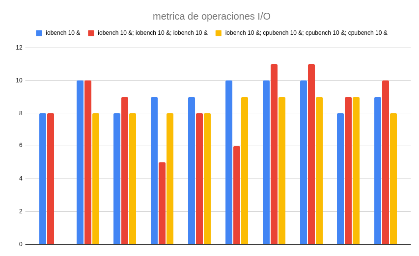
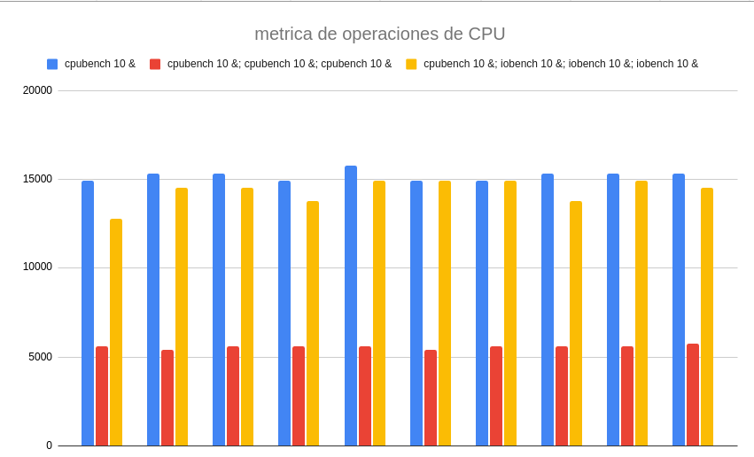

## Primera parte: Estudiando el planificador de xv6-riscv

### 1) *¿Qué política de planificación utiliza `xv6-riscv` para elegir el próximo proceso a ejecutarse?*
 El sistema operativo **xv6-riscv** utiliza una política de **Round-Robin**(Por cada CPU) como planificador, esto debido a que se ejecuta un proceso durante un tiempo predeterminado (quantum). Cuando un proceso agota su quantum o se bloquea, el planificador elige el siguiente proceso de la cola de "RUNNABLE". 

Cuando un proceso se ejecuta cambia su estado a RUNNING, al terminar su ejecución, se espera que cambie su estado de nuevo a RUNNABLE o a otro estado más adecuado, permitiendo al planificador elegir y seleccionar otro proceso.

### 2) *¿Cuáles son los estados en los que un proceso puede permanecer en xv6-riscv y qué los hace cambiar de estado?*

Los estados en los que puede estar un proceso son:

* UNUSED
* USED
* SLEEPING
* RUNNABLE
* RUNNING
* ZOMBIE

Los cambios de estado ocurren por cuestiones como la espera de recursos(RUNNABLE -> SLEEPING), cuando finaliza la ejecución(RUNNING -> ZOMBIE), la reactivación después de un evento(SLEEPING -> RUNNABLE), cuando se acaba el tiempo del quantum (RUNNING -> RUNNABLE) o cuando el planificador elige un proceso (RUNNABLE -> RUNNING)

### 3) *¿Qué es un *quantum*? ¿Dónde se define en el código? ¿Cuánto dura un *quantum* en `xv6-riscv`?*

Un quantum es la cantidad de tiempo que un proceso tiene para ejecutarse en la CPU antes de ser interrumpido y ceder la CPU a otro proceso. Este tiempo es fijo para todos los procesos y define cuánto tiempo puede ejecutar cada uno antes de que el planificador decida cambiar de contexto a otro proceso.

Se define en el archivo **start.c** dentro de la función **timerinit()**, en la **línea 69**.

**Un quantum dura 1.000.000 ciclos de cpu(virtuales), aproximadamente 1/10 segundos en qemu.**

### 4) *¿En qué parte del código ocurre el cambio de contexto en `xv6-riscv`? ¿En qué funciones un proceso deja de ser ejecutado? ¿En qué funciones se elige el nuevo proceso a ejecutar?*
El cambio de contexto ocurre en la función **swtch**, que es llamada desde el **scheduler** y **sched**. Un proceso deja de ser ejecutado en las funciones **sched, yield y sleep**, que cambian el estado del proceso para cambiar a otro.

El nuevo proceso se elige en la función **scheduler**, que recorre la tabla de procesos buscando uno con estado **RUNNABLE**.

###  5)  *¿El cambio de contexto consume tiempo de un *quantum*?*
 El cambio de contexto no consume tiempo del quantum, ya que mientras un proceso se está ejecutando, este no realiza trabajo relacionado al cambio de contexto, solo realiza sus tareas. El cambio de contexto implica guardar el estado del proceso actual y restaurar el estado del nuevo, lo que consume tiempo de **CPU**.

## Segunda Parte: Medir operaciones de cómputo y de entrada/salida

### Experimento 1: ¿Cómo son planificados los programas iobound y cpubound?
Para este experimento utlizaremos el largo de quantum 10 veces más pequeño que el original y un valor de N constante con valor 4. Se realizaran mediciones en los 
siguientes escenarios:

a. iobench N &\
b. iobench N &; iobench N &; iobench N &\
c. cpubench N &\
d. cpubench N &; cpubench N &; cpubench N &\
e. iobench N &; cpubench N &; cpubench N &; cpubench N &\
f. cpubench N &; iobench N &; iobench N &; iobench N &

### 1) Describa los parámetros de los programas cpubench e iobench para este experimento (o sea, los define al principio y el valor de N. Tener en cuenta que podrían cambiar en experimentos futuros, pero que si lo hacen los resultados ya no serán comparables).

Paramétros de los programas iobench y cpubench:

* start_tick: tick en el cual comienza el proceso, contado desde que inició xv6 
* end_tick: tick en el cual finaliza el proceso, contado desde que inició xv6 
* elapsed_ticks: cantidad de ticks que demora en completarse el proceso (diferencia entre end_tick y start_tick)  
* total_cpu_kops: total de kilo operaciones que realiza la multiplicación de matrices
* total_iops: total de operaciones I/O
* metric: metrica a definir para realizar las mediciones. En nuestro caso la definimos como: metric = total_cpu_kops / elapsed_ticks. Análogamente para operaciones I/O: metric = total_iops / elapsed_ticks. Es decir, la cantidad de operaciones que se realizan por cada tick.
* N: cantidad de veces que se repite el experimento

### 2) ¿Los procesos se ejecutan en paralelo? ¿En promedio, qué proceso o procesos se ejecutan primero? Hacer una observación cualitativa.
Los procesos no se ejecutan en paralelo ya que estamos ejecutando qemu con CPUS=1 (además esto también desactiva el hyperthreading). El tiempo en ticks no tiene una resolución tan alta como los nanosegundos, por lo que múltiples procesos que comienzan casi al mismo tiempo pueden compartir el mismo start_tick si la diferencia en tiempo de inicio entre ellos es menor que la duración de un solo tick.

Iteraciones para el escenario **iobench 10 &; cpubench 10 &; cpubench 10 &; cpubench 10 &**:

    

Iteraciones para el escenario **cpubench 10 &; iobench 10 &; iobench 10 &; iobench 10 &**:

  

Si ordenamos las mediciones por start_tick de menor a mayor, vemos que en la mayoría de los experimentos se ejecutan primero los procesos cpubench. De 4 ejecuciones del primer escenario y 3 del segundo escenario, solo en una
ejecución primero corrió el programa iobench, en los demás casos siempre fue primero el cpubench.

### 3) ¿Cambia el rendimiento de los procesos iobound con respecto a la cantidad y tipo de procesos que se estén ejecutando en paralelo? ¿Por qué?

Mediciones realizadas:

* **iobench 10 &**

| pid | program   | metric_name    | metric | start_tick | elapsed_ticks | average_io_metric |
|-----|-----------|----------------|--------|------------|---------------|-------------------|
| 21  | [iobench] | metric_name_io | 8      | 19383      | 121           | 9,1               |
| 21  | [iobench] | metric_name_io | 10     | 19504      | 102           |                   |
| 21  | [iobench] | metric_name_io | 8      | 19607      | 121           |                   |
| 21  | [iobench] | metric_name_io | 9      | 19728      | 107           |                   |
| 21  | [iobench] | metric_name_io | 9      | 19835      | 112           |                   |
| 21  | [iobench] | metric_name_io | 10     | 19947      | 100           |                   |
| 21  | [iobench] | metric_name_io | 10     | 20047      | 100           |                   |
| 21  | [iobench] | metric_name_io | 10     | 20147      | 100           |                   |
| 21  | [iobench] | metric_name_io | 8      | 20248      | 115           |                   |
| 21  | [iobench] | metric_name_io | 9      | 20364      | 103           |                   |

* **iobench 10 &; iobench 10 &; iobench 10 &**

| pid | program   | metric_name    | metric | start_tick | elapsed_ticks | average_io_metric |
|-----|-----------|----------------|--------|------------|---------------|-------------------|
| 27  | [iobench] | metric_name_io | 8      | 25069      | 82            | 9,166666667       |
| 28  | [iobench] | metric_name_io | 0      | 25069      | 114           |                   |
| 25  | [iobench] | metric_name_io | 7      | 25069      | 139           |                   |
| 27  | [iobench] | metric_name_io | 10     | 25151      | 101           |                   |
| 28  | [iobench] | metric_name_io | 9      | 25183      | 104           |                   |
| 25  | [iobench] | metric_name_io | 9      | 25209      | 105           |                   |
| 27  | [iobench] | metric_name_io | 9      | 25253      | 105           |                   |
| 28  | [iobench] | metric_name_io | 10     | 25287      | 94            |                   |
| 25  | [iobench] | metric_name_io | 7      | 25315      | 133           |                   |
| 28  | [iobench] | metric_name_io | 11     | 25382      | 89            |                   |
| 27  | [iobench] | metric_name_io | 5      | 25358      | 172           |                   |
| 28  | [iobench] | metric_name_io | 14     | 25471      | 71            |                   |
| 25  | [iobench] | metric_name_io | 8      | 25448      | 123           |                   |
| 28  | [iobench] | metric_name_io | 11     | 25542      | 92            |                   |
| 27  | [iobench] | metric_name_io | 8      | 25530      | 119           |                   |
| 25  | [iobench] | metric_name_io | 8      | 25571      | 120           |                   |
| 28  | [iobench] | metric_name_io | 10     | 25634      | 95            |                   |
| 25  | [iobench] | metric_name_io | 12     | 25691      | 79            |                   |
| 27  | [iobench] | metric_name_io | 6      | 25649      | 153           |                   |
| 28  | [iobench] | metric_name_io | 8      | 25729      | 121           |                   |
| 25  | [iobench] | metric_name_io | 8      | 25770      | 121           |                   |
| 27  | [iobench] | metric_name_io | 11     | 25802      | 93            |                   |
| 25  | [iobench] | metric_name_io | 15     | 25891      | 68            |                   |
| 27  | [iobench] | metric_name_io | 11     | 25895      | 88            |                   |
| 25  | [iobench] | metric_name_io | 16     | 25959      | 64            |                   |
| 28  | [iobench] | metric_name_io | 5      | 25851      | 185           |                   |
| 27  | [iobench] | metric_name_io | 9      | 25984      | 106           |                   |
| 28  | [iobench] | metric_name_io | 12     | 26036      | 82            |                   |
| 25  | [iobench] | metric_name_io | 8      | 26023      | 120           |                   |
| 27  | [iobench] | metric_name_io | 10     | 26090      | 94            |                   |

* **iobench 10 &; cpubench 10 &; cpubench 10 &; cpubench 10 &**

| pid | program    | metric_name     | metric | start_tick | elapsed_ticks | average_io_metric |
|-----|------------|-----------------|--------|------------|---------------|-------------------|
| 52  | [cpubench] | metric_name_cpu | 5592   | 89449      | 96            | 7,6               |
| 53  | [cpubench] | metric_name_cpu | 5263   | 89450      | 102           |                   |
| 50  | [cpubench] | metric_name_cpu | 4970   | 89448      | 108           |                   |
| 52  | [cpubench] | metric_name_cpu | 7780   | 89545      | 69            |                   |
| 53  | [cpubench] | metric_name_cpu | 7780   | 89552      | 69            |                   |
| 50  | [cpubench] | metric_name_cpu | 6627   | 89556      | 81            |                   |
| 52  | [cpubench] | metric_name_cpu | 5592   | 89614      | 96            |                   |
| 53  | [cpubench] | metric_name_cpu | 5112   | 89621      | 105           |                   |
| 50  | [cpubench] | metric_name_cpu | 4836   | 89637      | 111           |                   |
| 52  | [cpubench] | metric_name_cpu | 5592   | 89710      | 96            |                   |
| 53  | [cpubench] | metric_name_cpu | 5263   | 89726      | 102           |                   |
| 50  | [cpubench] | metric_name_cpu | 4836   | 89748      | 111           |                   |
| 52  | [cpubench] | metric_name_cpu | 5592   | 89806      | 96            |                   |
| 53  | [cpubench] | metric_name_cpu | 5263   | 89831      | 102           |                   |
| 50  | [cpubench] | metric_name_cpu | 4588   | 89859      | 117           |                   |
| 52  | [cpubench] | metric_name_cpu | 5592   | 89902      | 96            |                   |
| 53  | [cpubench] | metric_name_cpu | 5263   | 89933      | 102           |                   |
| 50  | [cpubench] | metric_name_cpu | 4970   | 89976      | 108           |                   |
| 52  | [cpubench] | metric_name_cpu | 5592   | 90001      | 96            |                   |
| 53  | [cpubench] | metric_name_cpu | 5263   | 90035      | 102           |                   |
| 52  | [cpubench] | metric_name_cpu | 5592   | 90097      | 96            |                   |
| 50  | [cpubench] | metric_name_cpu | 4970   | 90087      | 108           |                   |
| 53  | [cpubench] | metric_name_cpu | 5422   | 90137      | 99            |                   |
| 52  | [cpubench] | metric_name_cpu | 5772   | 90193      | 93            |                   |
| 50  | [cpubench] | metric_name_cpu | 4836   | 90195      | 111           |                   |
| 53  | [cpubench] | metric_name_cpu | 5422   | 90236      | 99            |                   |
| 52  | [cpubench] | metric_name_cpu | 5592   | 90289      | 96            |                   |
| 50  | [cpubench] | metric_name_cpu | 5477   | 90306      | 98            |                   |
| 53  | [cpubench] | metric_name_cpu | 6390   | 90335      | 84            |                   |
| 50  | [cpubench] | metric_name_cpu | 12484  | 90406      | 43            |                   |
| 48  | [iobench]  | metric_name_io  | 0      | 89457      | 1108          |                   |
| 48  | [iobench]  | metric_name_io  | 8      | 90566      | 122           |                   |
| 48  | [iobench]  | metric_name_io  | 8      | 90689      | 124           |                   |
| 48  | [iobench]  | metric_name_io  | 8      | 90813      | 124           |                   |
| 48  | [iobench]  | metric_name_io  | 8      | 90937      | 121           |                   |
| 48  | [iobench]  | metric_name_io  | 9      | 91058      | 110           |                   |
| 48  | [iobench]  | metric_name_io  | 9      | 91168      | 107           |                   |
| 48  | [iobench]  | metric_name_io  | 9      | 91275      | 109           |                   |
| 48  | [iobench]  | metric_name_io  | 9      | 91384      | 108           |                   |
| 48  | [iobench]  | metric_name_io  | 8      | 91493      | 122           |                   |

Como se ve en el valor de average_io_metric en las tablas, no cambia significativamente el rendimiento de los procesos iobound cuando se ejecutan en paralelo ya sea más procesos iobound o cpubound. Esto se debe a que las operaciones I/O no dependen de la CPU sino de la velocidad de procesamiento del dispositivo de lectura/escritura, por lo tanto solo este factor alteraría el rendimiento de este tipo de operaciones.

### 4) ¿Cambia el rendimiento de los procesos cpubound con respecto a la cantidad y tipo de procesos que se estén ejecutando en paralelo? ¿Por qué?

Mediciones realizadas:

* **cpubench 10 &**

| pid | program    | metric_name     | metric | start_tick | elapsed_ticks | average_cpu_metric |
|-----|------------|-----------------|--------|------------|---------------|--------------------|
| 8   | [cpubench] | metric_name_cpu | 14912  | 1804       | 36            | 15212,7            |
| 8   | [cpubench] | metric_name_cpu | 15338  | 1840       | 35            |                    |
| 8   | [cpubench] | metric_name_cpu | 15338  | 1875       | 35            |                    |
| 8   | [cpubench] | metric_name_cpu | 14912  | 1910       | 36            |                    |
| 8   | [cpubench] | metric_name_cpu | 15789  | 1947       | 34            |                    |
| 8   | [cpubench] | metric_name_cpu | 14912  | 1981       | 36            |                    |
| 8   | [cpubench] | metric_name_cpu | 14912  | 2017       | 36            |                    |
| 8   | [cpubench] | metric_name_cpu | 15338  | 2053       | 35            |                    |
| 8   | [cpubench] | metric_name_cpu | 15338  | 2088       | 35            |                    |
| 8   | [cpubench] | metric_name_cpu | 15338  | 2124       | 35            |                    |

* **cpubench 10 &;cpubench 10 &;cpubench 10 &**

| pid | program    | metric_name     | metric | start_tick | elapsed_ticks | average_cpu_metric |
|-----|------------|-----------------|--------|------------|---------------|--------------------|
| 14  | [cpubench] | metric_name_cpu | 5592   | 4395       | 96            | 5474,266667        |
| 12  | [cpubench] | metric_name_cpu | 5211   | 4393       | 103           |                    |
| 15  | [cpubench] | metric_name_cpu | 5112   | 4396       | 105           |                    |
| 14  | [cpubench] | metric_name_cpu | 5422   | 4491       | 99            |                    |
| 12  | [cpubench] | metric_name_cpu | 5112   | 4496       | 105           |                    |
| 15  | [cpubench] | metric_name_cpu | 5112   | 4501       | 105           |                    |
| 14  | [cpubench] | metric_name_cpu | 5592   | 4590       | 96            |                    |
| 12  | [cpubench] | metric_name_cpu | 5112   | 4601       | 105           |                    |
| 15  | [cpubench] | metric_name_cpu | 5263   | 4609       | 102           |                    |
| 14  | [cpubench] | metric_name_cpu | 5592   | 4686       | 96            |                    |
| 12  | [cpubench] | metric_name_cpu | 5263   | 4706       | 102           |                    |
| 15  | [cpubench] | metric_name_cpu | 5263   | 4714       | 102           |                    |
| 14  | [cpubench] | metric_name_cpu | 5592   | 4782       | 96            |                    |
| 12  | [cpubench] | metric_name_cpu | 5112   | 4808       | 105           |                    |
| 15  | [cpubench] | metric_name_cpu | 5422   | 4816       | 99            |                    |
| 14  | [cpubench] | metric_name_cpu | 5422   | 4878       | 99            |                    |
| 12  | [cpubench] | metric_name_cpu | 5263   | 4913       | 102           |                    |
| 15  | [cpubench] | metric_name_cpu | 5422   | 4918       | 99            |                    |
| 14  | [cpubench] | metric_name_cpu | 5592   | 4977       | 96            |                    |
| 15  | [cpubench] | metric_name_cpu | 5592   | 5020       | 96            |                    |
| 12  | [cpubench] | metric_name_cpu | 5112   | 5015       | 105           |                    |
| 14  | [cpubench] | metric_name_cpu | 5592   | 5073       | 96            |                    |
| 15  | [cpubench] | metric_name_cpu | 5592   | 5116       | 96            |                    |
| 12  | [cpubench] | metric_name_cpu | 5263   | 5120       | 102           |                    |
| 14  | [cpubench] | metric_name_cpu | 5592   | 5169       | 96            |                    |
| 15  | [cpubench] | metric_name_cpu | 5263   | 5212       | 102           |                    |
| 12  | [cpubench] | metric_name_cpu | 5112   | 5222       | 105           |                    |
| 14  | [cpubench] | metric_name_cpu | 5772   | 5268       | 93            |                    |
| 15  | [cpubench] | metric_name_cpu | 6710   | 5314       | 80            |                    |
| 12  | [cpubench] | metric_name_cpu | 7157   | 5327       | 75            |                    |

* **cpubench 10 &; iobench 10 &; iobench 10 &; iobench 10 &**

| pid | program    | metric_name     | metric | start_tick | elapsed_ticks | average_cpu_metric |
|-----|------------|-----------------|--------|------------|---------------|--------------------|
| 134 | [cpubench] | metric_name_cpu | 12781  | 141667     | 42            | 14348,1            |
| 134 | [cpubench] | metric_name_cpu | 14508  | 141709     | 37            |                    |
| 134 | [cpubench] | metric_name_cpu | 14508  | 141746     | 37            |                    |
| 134 | [cpubench] | metric_name_cpu | 13764  | 141783     | 39            |                    |
| 134 | [cpubench] | metric_name_cpu | 14912  | 141823     | 36            |                    |
| 134 | [cpubench] | metric_name_cpu | 14912  | 141859     | 36            |                    |
| 134 | [cpubench] | metric_name_cpu | 14912  | 141896     | 36            |                    |
| 134 | [cpubench] | metric_name_cpu | 13764  | 141932     | 39            |                    |
| 134 | [cpubench] | metric_name_cpu | 14912  | 141972     | 36            |                    |
| 134 | [cpubench] | metric_name_cpu | 14508  | 142008     | 37            |                    |
| 136 | [iobench]  | metric_name_io  | 2      | 141667     | 449           |                    |
| 139 | [iobench]  | metric_name_io  | 2      | 141671     | 461           |                    |
| 138 | [iobench]  | metric_name_io  | 2      | 141667     | 490           |                    |
| 138 | [iobench]  | metric_name_io  | 13     | 142157     | 75            |                    |
| 139 | [iobench]  | metric_name_io  | 7      | 142132     | 130           |                    |
| 136 | [iobench]  | metric_name_io  | 7      | 142117     | 145           |                    |
| 139 | [iobench]  | metric_name_io  | 13     | 142262     | 76            |                    |
| 136 | [iobench]  | metric_name_io  | 10     | 142262     | 95            |                    |
| 138 | [iobench]  | metric_name_io  | 6      | 142232     | 160           |                    |
| 139 | [iobench]  | metric_name_io  | 11     | 142339     | 92            |                    |
| 136 | [iobench]  | metric_name_io  | 11     | 142357     | 93            |                    |
| 139 | [iobench]  | metric_name_io  | 15     | 142431     | 68            |                    |
| 138 | [iobench]  | metric_name_io  | 7      | 142392     | 131           |                    |
| 136 | [iobench]  | metric_name_io  | 10     | 142450     | 100           |                    |
| 139 | [iobench]  | metric_name_io  | 7      | 142500     | 132           |                    |
| 136 | [iobench]  | metric_name_io  | 12     | 142550     | 82            |                    |
| 138 | [iobench]  | metric_name_io  | 6      | 142524     | 152           |                    |
| 136 | [iobench]  | metric_name_io  | 10     | 142632     | 97            |                    |
| 139 | [iobench]  | metric_name_io  | 8      | 142632     | 122           |                    |
| 138 | [iobench]  | metric_name_io  | 10     | 142679     | 97            |                    |
| 139 | [iobench]  | metric_name_io  | 11     | 142754     | 93            |                    |
| 136 | [iobench]  | metric_name_io  | 6      | 142730     | 148           |                    |
| 138 | [iobench]  | metric_name_io  | 10     | 142776     | 102           |                    |
| 138 | [iobench]  | metric_name_io  | 12     | 142878     | 83            |                    |
| 139 | [iobench]  | metric_name_io  | 6      | 142847     | 152           |                    |
| 136 | [iobench]  | metric_name_io  | 8      | 142878     | 121           |                    |
| 138 | [iobench]  | metric_name_io  | 11     | 142961     | 91            |                    |
| 136 | [iobench]  | metric_name_io  | 12     | 142999     | 84            |                    |
| 139 | [iobench]  | metric_name_io  | 10     | 142999     | 97            |                    |
| 138 | [iobench]  | metric_name_io  | 11     | 143052     | 90            |                    |

Como se ve en el valor de average_cpu_metric en las tablas, el rendimiento de los procesos CPU bound sí se ve afectado por la cantidad de procesos ejecutándose en paralelo, especialmente cuando estos procesos son también CPU bound. Esto se debe a que los procesos CPU bound requieren mucho tiempo de procesador y, al ejecutar varios en paralelo, comparten el tiempo de CPU disponible. Como el sistema operativo debe distribuir el tiempo de CPU entre ellos, se reduce el rendimiento.
En cambio, el rendimiento de los procesos I/O bound depende principalmente del dispositivo de entrada/salida, que requieren menos recursos de CPU, permitiendo que los procesos CPU bound utilicen el procesador sin interferencia significativa de los procesos I/O bound.

### 5) ¿Es adecuado comparar la cantidad de operaciones de cpu con la cantidad de operaciones iobound?
No es adecuado comparar la cantidad de operaciones de cpu con la cantidad de operaciones iobound. Por los siguientes motivos:
- Distintos recursos, las operaciones cpubound están limitadas por la velocidad del procesamiento de la cpu, lo que nos indica que en general usa el procesador y a esperar hasta que hayan ciclos disponibles. En cambio, la iobound está limitada por la velocidad de los dispositivos de entrada/salida y por el tiempo de espera hasta que la información este lista. Lo cual hace que dependan menos de la cpu.
- Tiempos de espera: en cpubound se suele ejecutar de forma continua, en cambio, en iobound suele influir la espera, donde el sistema puede cambiar de contexto y permitir a otros procesos ejecutarse.

## Segunda parte: ¿Qué sucede cuando cambiamos el largo del quantum?

### 1) ¿Fue necesario modificar las métricas para que los resultados fueran comparables? ¿Por qué?

Sí, **solo** fue necesario modificar las métricas en iobench para que los resultados fueran comparables.

La razón principal es que al reducir el quantum, el sistema operativo interrumpe los procesos con mayor frecuencia, lo que introduce un overhead de cambios de contexto. Este overhead afecta el tiempo de **finalización** de los procesos, **incrementándolo**.

Sin ajustar las métricas, las operaciones no se registraban de manera representativa (en el caso inicial, mostraban 0 en iobench), lo que dificultaba la comparación de resultados.
Al modificar la métrica,como lo hicimos al multiplicarlas por 10 (Q=10.000) y 100 (Q=1.000) en iobench, logramos que los valores de operaciones reflejaran de manera más precisa la cantidad de trabajo realizado, permitiendo una evaluación más clara y objetiva del rendimiento.

* **iobench 10 & SIN MODIFICAR METRICA (Q=10.000)**

| pid | program   | metric_name    | ops | start_tick | elapsed_ticks |
|-----|-----------|----------------|-----|------------|---------------|
| pid | [iobench] | metric_name_io |   0 |      10537 |          1419 |
| pid | [iobench] | metric_name_io |   0 |      11959 |          1365 |
| pid | [iobench] | metric_name_io |   0 |      13328 |          1382 |
| pid | [iobench] | metric_name_io |   0 |      14714 |          1149 |
| pid | [iobench] | metric_name_io |   0 |      15867 |          1132 |
| pid | [iobench] | metric_name_io |   0 |      17003 |          1312 |
| pid | [iobench] | metric_name_io |   0 |      18317 |          1238 |
| pid | [iobench] | metric_name_io |   0 |      19559 |          1379 |
| pid | [iobench] | metric_name_io |   0 |      20941 |          1349 |
| pid | [iobench] | metric_name_io |   0 |      22293 |          1319 |

* **cpubench 10 & SIN MODIFICAR METRICA (Q=10.000)**

| pid | program    | metric_name     | metric | start_tick | elapsed_ticks |
|-----|------------|-----------------|--------|------------|---------------|
|   4 | [cpubench] | metric_name_cpu |   1931 |       5833 |           278 |
|   4 | [cpubench] | metric_name_cpu |   1726 |       6113 |           311 |
|   4 | [cpubench] | metric_name_cpu |   1338 |       6428 |           401 |
|   4 | [cpubench] | metric_name_cpu |   1355 |       6833 |           396 |
|   4 | [cpubench] | metric_name_cpu |   1355 |       7233 |           396 |
|   4 | [cpubench] | metric_name_cpu |   1345 |       7633 |           399 |
|   4 | [cpubench] | metric_name_cpu |   1352 |       8036 |           397 |
|   4 | [cpubench] | metric_name_cpu |   1345 |       8437 |           399 |
|   4 | [cpubench] | metric_name_cpu |   1352 |       8840 |           397 |
|   4 | [cpubench] | metric_name_cpu |   1345 |       9241 |           399 |

### 2) ¿Qué cambios se observan con respecto al experimento anterior? ¿Qué comportamientos se mantienen iguales?

### 3) ¿Con un quantum más pequeño, se ven beneficiados los procesos iobound o los procesos cpubound?
Los procesos iobench se ven beneficiados con un quantum más pequeño. Como podemos ver en las tablas del escenario cpubench 10 &; iobench 10 &; iobench 10 &; iobench 10 &,  en el caso de quantum=100.000 los procesos iobench , en general, tienen que esperar a que terminen los cpubench. En cambio, con quantum=1.000 vemos una planificación mucho más pareja entre procesos cpubench e iobench.

#### Quantum(1000) cpubench 10 &; iobench 10 &; iobench 10 &; iobench 10 &

| pid | bench      | metricname      | metric | start tick | elapsed ticks |
|-----|------------|-----------------|--------|------------|---------------|
|  25 | [cpubench] | metric_name_cpu |     13 |    6565696 |         40342 |
|  29 | [iobench]  | metric_name_io  |      2 |    6565714 |         36830 |
|  27 | [iobench]  | metric_name_io  |      2 |    6565737 |         41547 |
|  30 | [iobench]  | metric_name_io  |      2 |    6565861 |         42099 |
|  29 | [iobench]  | metric_name_io  |      2 |    6602786 |         39850 |
|  25 | [cpubench] | metric_name_cpu |     12 |    6606386 |         42536 |
|  27 | [iobench]  | metric_name_io  |      2 |    6607520 |         46810 |
|  30 | [iobench]  | metric_name_io  |      2 |    6608215 |         42886 |
|  29 | [iobench]  | metric_name_io  |      2 |    6642908 |         39115 |
|  25 | [cpubench] | metric_name_cpu |     12 |    6649210 |         43593 |
|  30 | [iobench]  | metric_name_io  |      2 |    6651426 |         41761 |
|  27 | [iobench]  | metric_name_io  |      2 |    6654678 |         41792 |
|  29 | [iobench]  | metric_name_io  |      2 |    6682275 |         38118 |
|  25 | [cpubench] | metric_name_cpu |     13 |    6693118 |         40208 |
|  30 | [iobench]  | metric_name_io  |      2 |    6693488 |         42158 |
|  27 | [iobench]  | metric_name_io  |      2 |    6696650 |         40881 |
|  29 | [iobench]  | metric_name_io  |      2 |    6720617 |         35798 |
|  25 | [cpubench] | metric_name_cpu |     13 |    6733643 |         40555 |
|  30 | [iobench]  | metric_name_io  |      2 |    6735944 |         37135 |
|  27 | [iobench]  | metric_name_io  |      2 |    6737754 |         38101 |
|  29 | [iobench]  | metric_name_io  |      2 |    6756710 |         34139 |
|  30 | [iobench]  | metric_name_io  |      2 |    6773378 |         39900 |
|  25 | [cpubench] | metric_name_cpu |     13 |    6774430 |         41071 |
|  27 | [iobench]  | metric_name_io  |      2 |    6776229 |         37910 |
|  29 | [iobench]  | metric_name_io  |      2 |    6791058 |         35290 |
|  30 | [iobench]  | metric_name_io  |      2 |    6813552 |         41739 |
|  27 | [iobench]  | metric_name_io  |      2 |    6814366 |         45736 |
|  25 | [cpubench] | metric_name_cpu |     13 |    6815666 |         40688 |
|  29 | [iobench]  | metric_name_io  |      2 |    6826568 |         35502 |
|  30 | [iobench]  | metric_name_io  |      2 |    6855614 |         41507 |
|  25 | [cpubench] | metric_name_cpu |     14 |    6856701 |         38103 |
|  27 | [iobench]  | metric_name_io  |      2 |    6860538 |         37455 |
|  29 | [iobench]  | metric_name_io  |      3 |    6862396 |         31837 |
|  29 | [iobench]  | metric_name_io  |      2 |    6894458 |         35321 |
|  25 | [cpubench] | metric_name_cpu |     13 |    6895082 |         39557 |
|  30 | [iobench]  | metric_name_io  |      2 |    6897453 |         40100 |
|  27 | [iobench]  | metric_name_io  |      2 |    6898206 |         40689 |
|  25 | [cpubench] | metric_name_cpu |     15 |    6934877 |         34693 |
|  30 | [iobench]  | metric_name_io  |      2 |    6937785 |         35067 |
|  27 | [iobench]  | metric_name_io  |      3 |    6939082 |         32724 |